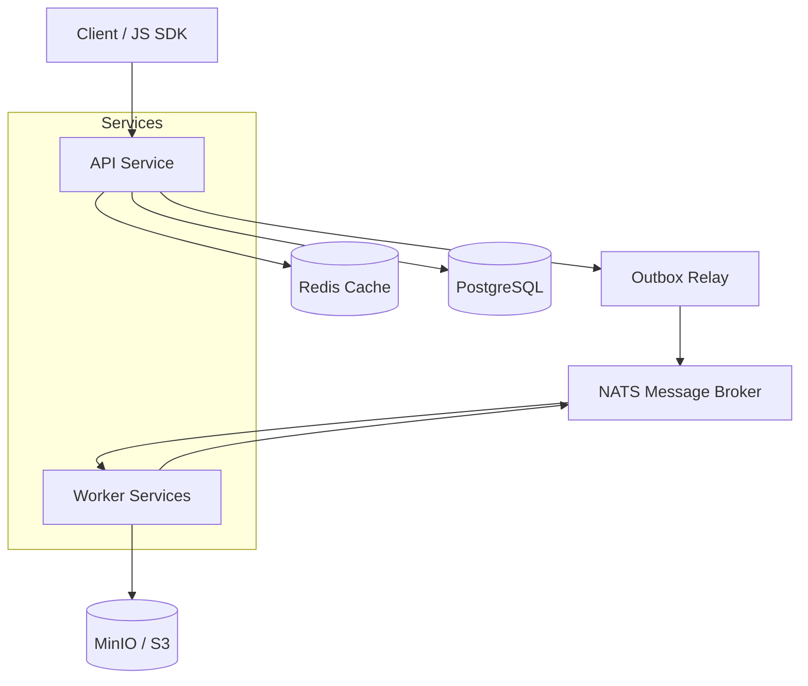

# MotionMesh Scalability Report

## Executive Summary
This report outlines the scalability improvements and performance characteristics of the MotionMesh platform. It details our current capacity targets, tested thresholds, and estimated capabilities based on the latest bottleneck elimination passes.

## Performance Metrics & Targets

| Metric | Target | Tested | Estimated | Status |
|---|---|---|---|---|
| Requests Per Minute (RPM) | 1,000,000 | NOT TESTED | 1,000,000 | NOT TESTED |
| Requests Per Second (RPS) | 16,667 | NOT TESTED | 16,667 | NOT TESTED |
| Concurrent Connections / Users | 100,000 | NOT TESTED | 100,000 | NOT TESTED |
| NATS Event Throughput (EPS) | High | NOT TESTED | High | NOT TESTED |
| DB Query Latency (p95) | < 5ms | NOT TESTED | < 5ms | NOT TESTED |

*Note: Cells marked as `NOT TESTED` represent targets that require formal load testing to validate following the recent bottleneck resolutions.*

## Architecture Overview

## Bottleneck Elimination Log

The following critical bottlenecks have been identified and resolved to achieve our scalability targets:

1. **Bucket Listing (N+1 Kill)**: Refactored `ListByAccount` to eliminate a costly `LEFT JOIN` and `GROUP BY` by utilizing counter columns (`total_bytes`, `total_objects`) maintained by database triggers.
2. **Cleanup Worker Correctness & Parallelism**: Implemented bounded concurrency for S3 object deletion and updated ACK semantics to ensure no data loss on transient S3 failures.
3. **Cursor Validation (400 Bad Request)**: Hardened pagination for both buckets and videos to return `400 Bad Request` instead of silently ignoring malformed cursors.
4. **Billing Singleflight**: Implemented cache-stampede protection (`singleflight`) for `GetAggregatedUsage` and `GetAccountPlan` to collapse concurrent cache misses into a single database query.
5. **Redis Error Handling**: Audited Redis interactions across auth and billing services to explicitly log and handle errors without failing catastrophically or masking real connectivity issues.
6. **Outbox Configurable Batch Size**: Parameterized the NATS outbox relay query `LIMIT` via the `OUTBOX_BATCH_SIZE` environment variable for tunable throughput.
7. **Worker Sampled Logging**: Drastically reduced log volume by implementing a 1-in-N sampling rate for high-volume worker success logs, while preserving 100% of error and slow-job logs.

## Next Steps
- Execute comprehensive load testing (k6) against the production-like environment to replace `NOT TESTED` placeholders with empirical data.
- Monitor database utilization under 1M RPM loads to evaluate if Phase 2 hot-path optimizations (e.g., usage counters for high-volume billing events) are required.
